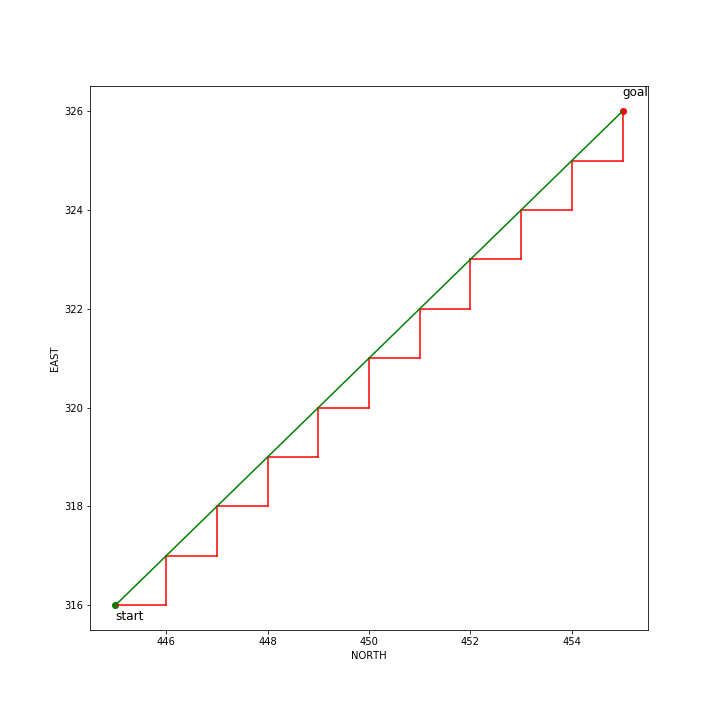
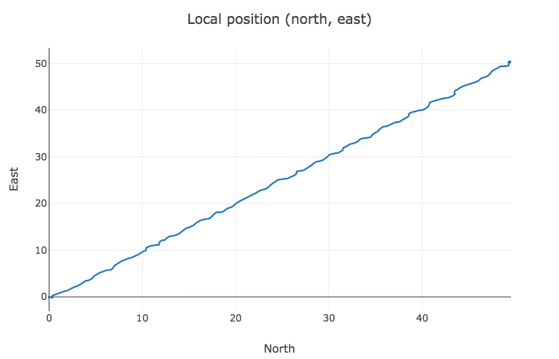
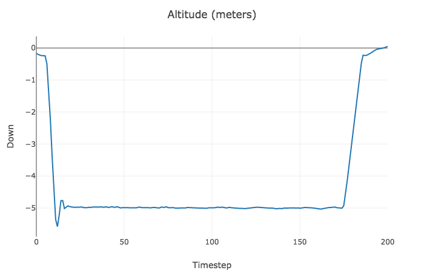
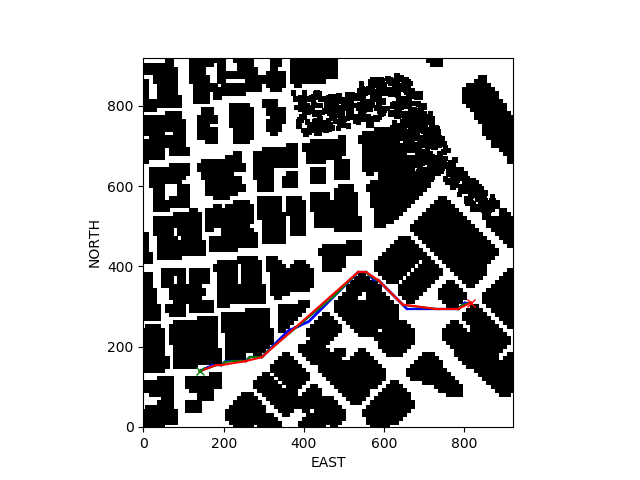
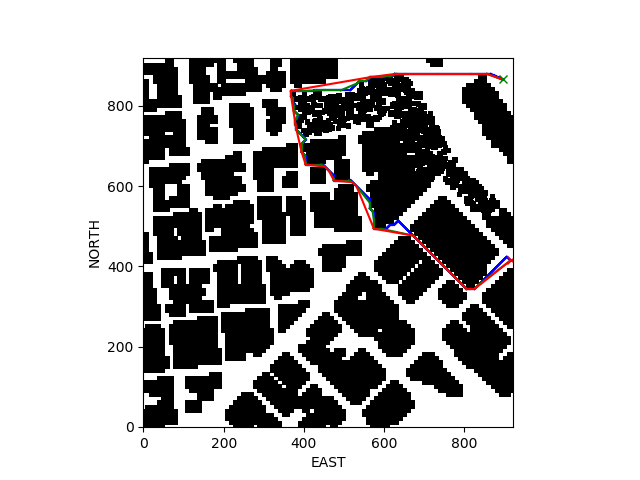

## Project: 3D Motion Planning
### Saminda Abeyruwan


---
### Explain the Starter Code

#### 1. Explain the functionality of what's provided in `motion_planning.py` and `planning_utils.py`

* __planning_utils.py__:
    * _create_grid_: creates a dense 2D grid such that the no-fly zones are marked with one. 
'data' contains the matrix read from 'colliders.csv' where posX maps to north and posY maps to east coordinates.
(0, 0) represents minimum north and east coordinates, while the resolution of the grid is set to 1 meters. 
We have developed this mapping in one of the assignments.
    * _a_star_: find A* path from the grid, start, and goal tuples. The implementation only
provides L^2-norm as the heuristic, which is implemented in the 'heuristic' function. We have implemented 
this form of A* in one of the assignments.  
    * _valid_actions_: provides at most four move action of one meter towards north, south, east and west. Only valid 
actions within the grid are allowed.

* __motion_planning.py__
    * The initial script resembles the _backyard_flyer.py_, we have implemented in the 
first project. Instead of moving around square, in this script we define a start and goal
tuples, and used the A* to find a path. 
    * The 'plan_path' has been called after the drone is armed, which:
        * reads the colliders.csv, 
        * creates the grid, with safety distance and drone altitude five meters,
        * set up the start tuple, which is just a transformation of the 
        grid offset to center of the map, and goal tuple, which is 10 meters from 
        north and east. 
        * calls A* to gets the path and setup the 'waypoints' from the path. 
        The waypoints are also transformed to the map coordiates using north and east offsets.
    * The shortest path from start to goal is in the diagonal. But the allowed actions does not have 
    the diagonal action build-in. Therefore, the A* needs to zig-zag to reach the goal. E.g.,:
        * start tuple (316, 445), and goal tuple (326, 455)
        * The first action selected by A* is to move north. Even though there is another potential action east
        with the same cost (with the heuristic) added to the queue, Python PriotyQueue selects the state that moves 
        the drone to north. 
        * From this new state, only east is the movement that the heuristic selects as the closest to the goal.
        * Therefore, A* selects actions that zig-zag the diagonal to read the goal (Figure 1).
          

    * The waypoint transition happens within a radius of 1 m. Once the drone follows all the waypoints are explored, the drone starts landing once the 
    velocity of the drone is less that 1 m/s. The drone disarm, if the home and global
    height difference is less than 0.1 m and the drone is very close to ground with less 
    that 0.01 m. These are the deadbands used by the demo implementation. 
    * The following plots (using Visdom server) show the actual path taken by the drone for the demo
    implementation for 50 meters offset.

              

### Implementing Your Path Planning Algorithm

I have implemented the required flying specification in the _motion_planning.py_ and _planning_utils.py_ files. 

#### 1. Set your global home position
_get_latlog_ reads the latitude and longitude.  

#### 2. Set your current local position
_curr_local_position_ has been calculated from _global_to_local(curr_global_position, self.global_home)_.

#### 3. Set grid start position from local position
_grid_start_ has been calculated from the appropriate offsets. The drone can start from
any free position in the grid and the _grid_start_ correctly reflects that position. 

#### 4. Set grid goal position from geodetic coords

Random geodetic coords have been sampled from the free space and converted to 
the _grid_goal_.

#### 5. Modify A* to include diagonal motion (or replace A* altogether)

I have add the diagonal actions:
* NORTH_EAST = (1, 1, np.sqrt(2))
* NORTH_WEST = (1, -1, np.sqrt(2))
* SOUTH_WEST = (-1, -1, np.sqrt(2))
* SOUTH_EAST = (-1, 1, np.sqrt(2))

#### 6. Cull waypoints 

After a path has been found from A* (if we sample coords from a hole inside a building, 
a path cannot be found), I have used two methods to smooth the paths:

* divide and concur with Bresenham smoothing: in this method, I have implemented the
_SMOOTH_ algorithm given in _Motion planning using adaptive random walks_. This is a 
divide and concur method, which prune the original path considerably. 

* Greedy smoothing: I have implemented my own greedy smoothing method. In this 
method, I have used the path order to prune nodes. The algorithm is:

```python
def greedy_smooth_path(grid, path, k=5):
    if len(path) < 3:
        return path

    pruned_path = []
    i = 0
    while i < len(path) - 1:
        pruned_path.append(path[i])
        j = i + 1
        ii = -1
        while j < min(j + k, len(path) - 1):
            if can_connect_segment(grid, path[i], path[j]):
                ii = j
            j += 1
        if ii != -1:
            i = ii
        else:
            i += 1
    pruned_path.append(path[-1])
    return pruned_path

```

From a given position, i, we look forward to j in [i + 1, min(i + 1 + k, len(path) - 1)) nodes, and 
if the line segment between path[i], path[j] connects (using Bresenham), we prune all
the nodes in [i + 1, j). This method further prune the path. As an example, I have randomly
sample start and goal position from the environment and generated a path and calculated
the number of edges in the path:

* Red cross: start
* Green corss: goal,
* Blue path: A* path,
* Green path: divide and concur with Bresenham smoothing, and
* Red path: final path after greedy smoothing.   

E.g., (1):


a_star = 677, divide and concur with Bresenham smoothing = 70, and greedy smoothing = 12 


E.g., (2): 
a_star = 1295, divide and concur with Bresenham smoothing = 186, and greedy smoothing = 23 




### Execute the flight
#### 1. Does it work?
It works! The method calculate the path during the _armed_ state. Once the a path is 
found, we convert it to waypoints and send to the drone. Once the path has been
completed, the drone is disarmed. 